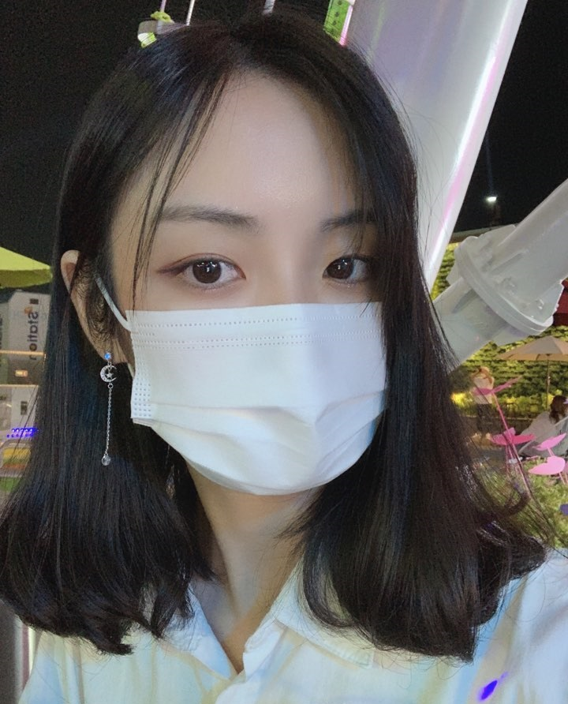

<!---->
<!---->
<!---->
<!---->

* Name: JiHyeon-Lee

<d1>
  <dt>CONTACT</dt>
  <dd>Email: ice6723@naver.com</dd>
  <dd>github: https://github.com/hyeon313</dd>
  
  <dt>EDUCATION</dt>
    <dd>2016-present</dd>
    <dd>Kyungil university</dd>
  
  <dt>SKILLS</dt>
    <dd>C++</dd>
    <dd>Python</dd>
    <dd>canon DSLR</dd>
    <dd>Adobe Photoshop</dd>
    <dd>Adobe AfterEffects</dd>
    <dd>Adobe PrimierPro</dd>
</d1>

