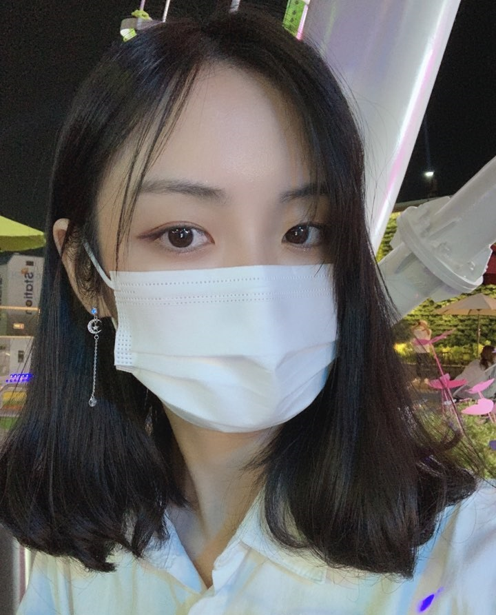

<!---->
<!---->
<!---->
<!---->

# JiHyeon-Lee

<d1>
  <dt>CONTACT</dt>
  <dd>Email: ice6723@naver.com</dd>
  <dd>github: https://github.com/hyeon313</dd>
  <dd>birthday: 1997.3.13</dd>
  
  <dt>OBJECTIVE</dt>
  <dd>career goal: A.I Developer and Data Scientist</dd>
  <dd>Seeking a position programming</dd>
  
  <dt>EDUCATION</dt>
  <dd>Major in Photography and Motion-picture, Computer Engineering   Kyungil university    2016~2019</dd>
  <dd>                                                                Seokang high school   2013-2015</dd>
  
  <dt>EXPERICENCE</dt>
    <dd>2ver-Media field practice 2019-8(month)</dd>
    
  <dt>SKILLS</dt>
    <dd>C++</dd>
    <dd>Python</dd>
    <dd>canon DSLR</dd>
    <dd>Adobe Photoshop</dd>
    <dd>Adobe AfterEffects</dd>
    <dd>Adobe PrimierPro</dd>
  
</d1>

